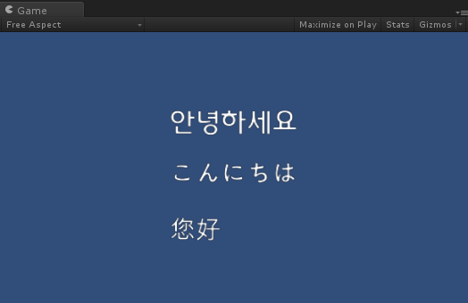

# Unity-CustomDynamicFont
A simple bare-bone sample which demonstrates to use ones own dynamic font.

No font coloring, no alignment, no wordwrap but the project shows only minimum code to render a text with Unity3D's dynamic font renderer.

